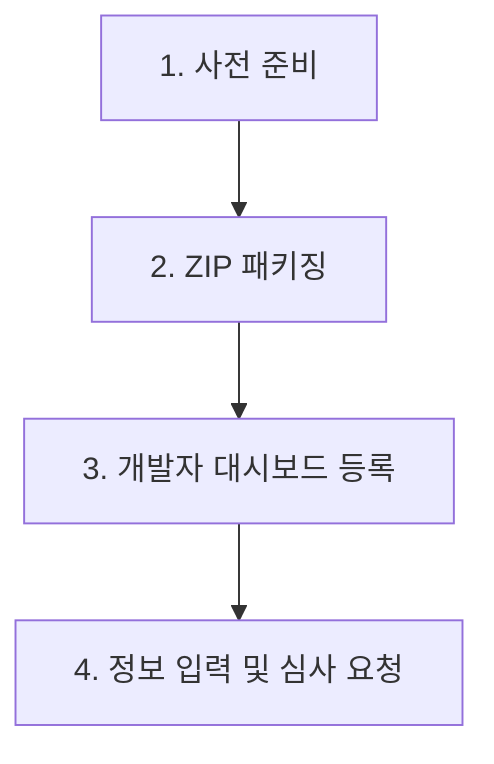

# Chrome Web Store 배포 매뉴얼

이 매뉴얼은 `Right-click on Web` 확장 프로그램을 Chrome Web Store에 등록하고 배포하는 전체 과정을 단계별로 안내합니다.

---

## 📋 배포 흐름 요약



---

## 1단계: 사전 준비 (Preparation)

확장 프로그램을 스토어에 등록하기 전에 아래 세 가지 사항이 미리 준비되어야 합니다.

### ① 크롬 개발자 계정 등록
* [Chrome 개발자 대시보드](https://chrome.google.com/webstore/devconsole)에 접속하여 Google 계정으로 로그인합니다.
* 최초 등록 시 **$5(USD)의 일회성 등록 수수료** 결제가 필요합니다.

### ② 스토어 등록용 이미지 자산 준비
* **아이콘**: 프로젝트 내 `icons/icon128.png`가 준비되어 있어 그대로 사용하면 됩니다.
* **스크린샷**: 
  - 규격: **1280×800** 또는 **640×400** 크기의 PNG/JPG 이미지 (최소 1장 필수, 최대 5장 권장).
  - 추천 구성: 팝업 실행 화면 캡처 1장, 차단 사이트 테스트 화면 캡처 1장.

### ③ 개인정보처리방침 (Privacy Policy) URL
* 이 확장 프로그램은 모든 사이트에서 동작하기 위해 `<all_urls>` (호스트 권한)을 사용하므로, 구글 정책상 **개인정보처리방침 URL 기재가 필수**입니다.
* **가장 쉬운 연동 방법 (GitHub Pages)**:
  1. 프로젝트 내 `docs/privacy-policy.html` 파일을 작성합니다.
  2. GitHub 저장소 설정(Settings) -> Pages 메뉴에서 GitHub Pages를 활성화합니다.
  3. 활성화된 URL(예: `https://chrythjin.github.io/Right-click-on-web/privacy-policy.html`)을 확보합니다.
* **최소 개인정보처리방침 내용 구성**:
   > 본 프로그램은 사용자의 브라우징 데이터나 개인정보를 수집하거나 원격 서버로 전송하지 않습니다. 사용자가 직접 설정한 전역·도메인별 옵션만 브라우저의 `chrome.storage.sync`에 동기화되며, 동기화가 불가능한 경우 `chrome.storage.local`에 현재 기기용으로 저장됩니다.

---

## 2단계: ZIP 패키징 (Packaging)

배포를 하려면 소스 코드를 규격에 맞는 ZIP 파일로 압축해야 합니다. 이때 빌드 설정 파일, 테스트 코드, 개발 문서 등 **불필요한 파일이 압축에 포함되면 스토어 심사 거절 사유가 될 수 있으므로 제외**해야 합니다.

### 💻 압축 명령어 실행 (PowerShell 기준)

프로젝트 루트 폴더(`c:\NEW PRG\Right-click-on-web`)에서 PowerShell을 열고 다음 명령어를 실행합니다.

```powershell
Compress-Archive -Path manifest.json,shared.js,background.js,content.js,content-main.js,popup.html,popup.css,popup.js,options.html,options.css,options.js,icons -DestinationPath "right-click-on-web.zip" -Force
```

* **포함 대상**: `manifest.json`, `shared.js`, `background.js`, `content.js`, `content-main.js`, `popup.html`, `popup.css`, `popup.js`, `options.html`, `options.css`, `options.js`, `icons/`
  - ⚠️ **`content-main.js` (MAIN world 패처) 반드시 포함** — v0.2.0 듀얼 스크립트 아키텍처의 핵심. 누락 시 페이지 차단 스크립트 무력화가 동작하지 않음.
* **제외 대상**: `.git/`, `.serena/`, `.omo/`, `history/`, `docs/`, `tests/`, `README.md`, `popup-preview.html`

압축 결과물인 `right-click-on-web.zip` 파일이 생성됩니다.

---

## 3단계: 개발자 대시보드 등록 (Developer Dashboard)

1. [Chrome 개발자 대시보드](https://chrome.google.com/webstore/devconsole)로 이동합니다.
2. 오른쪽 상단의 **[+ 새 항목]** 또는 **[Add new item]** 버튼을 클릭합니다.
3. 2단계에서 생성한 `right-click-on-web.zip` 파일을 드래그하여 업로드합니다.

---

## 4단계: 스토어 정보 입력 및 심사 제출 (Listing & Submit)

ZIP 업로드가 완료되면 대시보드 내 좌측 메뉴를 순서대로 채워 넣습니다.

### ① 스토어 명세 (Store Listing)
* **이름**: `Right-click on Web` (manifest.json의 이름이 기본 입력됨)
* **짧은 설명**: `우클릭, 선택, 복사 방해를 일반 웹으로 되돌립니다.` (최대 132자)
* **상세 설명**: 아래 서식 참고하여 입력
  ```text
  우클릭 방지, 텍스트 드래그 선택 방지, 복사/잘라내기 방지 설정을 완화하여 일반적인 웹 브라우징 상태로 안전하게 복원합니다.

  [주요 기능]
  - 잠겨있는 마우스 오른쪽 버튼 메뉴(콘텍스트 메뉴) 복원
  - 마우스 드래그를 통한 텍스트 선택 허용
  - 복사(Ctrl+C) 및 잘라내기 단작동 정상화
   - 직관적인 팝업 UI를 통한 원클릭 전역 ON/OFF 제어
   - 전체 설정 화면에서 저장된 사이트별 ON/OFF·Lite/Ultimate 모드 관리
  - 리소스 낭비가 없는 가볍고 빠른 논-블로킹 설계

  [제한 사항]
  - 이 프로그램은 기술적 표준에 따라 동작하므로, 웹 표준 외부의 시스템(DRM 보호 미디어, 금융 보안 화면, 이미지/캔버스 안에 그려진 글자, 캡슐화된 Shadow DOM) 내에서는 작동이 제한될 수 있습니다.

  [개인정보 보호 약속]
   - 본 프로그램은 사용자 정보를 수집·가공·원격 서버로 전송하지 않습니다. 사용자가 직접 지정한 설정만 브라우저 동기화에 저장됩니다.
  ```
* **카테고리**: `생산성` (Productivity) 또는 `도구` (Developer Tools)
* **스크린샷**: 1단계에서 준비한 PNG 파일 업로드

### ② 개인정보 보호 선언 (Privacy)
* **단일 목적 선언(Single Purpose)**: 
  - `이 확장 프로그램은 웹 페이지의 마우스 우클릭, 드래그 선택, 복사 차단 스크립트를 완화하여 사용자 편의를 도모하는 하나의 목적으로만 작동합니다.`
* **사용 권한 선언(Permission Justification)**:
  - `<all_urls>`(또는 호스트 권한) 사유: `사용자가 방문하는 다양한 웹 사이트의 차단 스크립트를 실시간으로 감지하고 완화하기 위해 전체 웹 주소 접근 권한이 필요합니다.`
* **데이터 사용 수집(Data Practices)**:
  - 모든 항목에 **[수집하지 않음]** 또는 **[아니오]**를 체크합니다. (실제 데이터 수집 기능이 없으므로 중요)
* **개인정보처리방침 URL**: 1단계에서 확보한 GitHub Pages 등의 개인정보처리방침 주소를 붙여넣습니다.

### ③ 제출 및 심사 (Submit for Review)
1. 모든 필드 입력 후 우측 상단의 **[제출하여 검토받기]** 또는 **[Submit for Review]** 버튼을 누릅니다.
2. 구글 측의 심사는 보통 **2일 ~ 5일** 정도 소요되며, 심사가 완료되면 스토어에 자동으로 배포 및 게시됩니다.

---

## 🔄 추후 업데이트(패치) 방법

새 버전을 배포해야 하는 경우 다음 절차를 따릅니다.

1. `manifest.json` 파일의 `"version"` 필드를 올립니다. (예: `0.1.0` -> `0.1.1` 또는 `1.0.0`)
2. 2단계의 압축 명령어를 사용하여 새로운 ZIP 패키지를 생성합니다.
3. 개발자 대시보드에서 해당 항목 클릭 -> **[패키지 업로드]** 클릭하여 새 ZIP 파일 등록 후 다시 **[검토 요청]**을 제출합니다.
