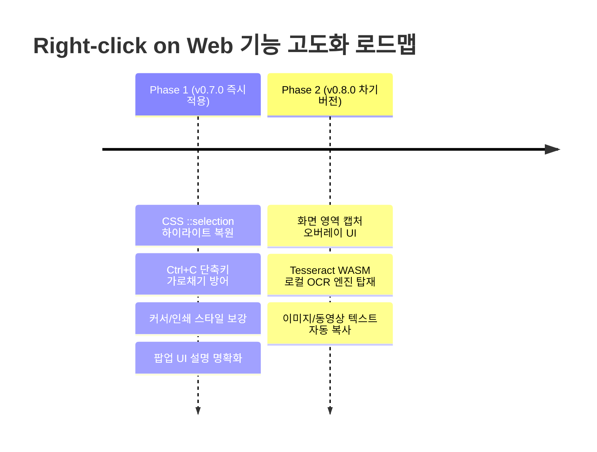

# 우클릭 및 복사 기능 강화 벤치마킹 분석 보고서

**일자:** 2026-08-12  
**대상 확장:** 우클릭 차단 종결자 (Ultimate Enable Right Click, `emfeppdfcjnldjgmofdkbggeacapegen`)  
**기준 버전:** Right-click on Web v0.6.3  
**작성 목적:** 경쟁 확장의 "블록 지정 활성화 (CSS)" 원리 분석, 현재 아키텍처 비교 검토, 및 웹사이트의 복사 방해·변조(출처 삽입, 글자 수 제한, 선택 영역 리셋 등)를 원천 차단하는 클립보드 복사 고도화 방안 수립

---

## 1. 개요 및 벤치마킹 배경

사용자가 문의한 문구:
> "블록 지정 활성화 (CSS): 해당 사이트의 일부 문구는 자바스크립트 외에 CSS로 드래그를 막아두었으므로, 브라우저 상단의 '우클릭 차단 종결자' 확장 프로그램 아이콘을 클릭한 뒤 '블록 지정 활성화(CSS)' 옵션을 켜주시면 텍스트 드래그 및 우클릭이 가능해집니다."

최근 웹사이트들은 단순 `oncontextmenu="return false"` 같은 초보적인 자바스크립트 차단을 넘어, **CSS 렌더링 엔진 속성** 및 **클립보드 이벤트 변조(Clipboard Hijacking)** 기법을 사용하여 사용자의 정상적인 텍스트 복사 및 스크랩을 방해하고 있습니다.

본 보고서에서는 해당 기능의 원리를 명확히 규명하고, 현재 `Right-click on Web`의 구현 상태와 비교한 후, **완벽한 내용 복사를 보장하기 위한 추가 개선 기술**을 도출합니다.

---

## 2. "블록 지정 활성화 (CSS)" 원리 및 비교 분석

### 2.1 CSS 드래그 차단 원리
* **`user-select: none`**: 브라우저 렌더링 엔진에 텍스트 선택 영역(Selection Range) 생성을 원천 차단하도록 지시합니다. 자바스크립트 이벤트가 발생하기 전에 브라우저 레벨에서 마우스 드래그를 무시합니다.
* **벤더 프리픽스**: `-webkit-user-select: none;`, `-moz-user-select: none;`, `-ms-user-select: none;` 등이 광범위하게 사용됩니다.
* **드래그 차단**: `-webkit-user-drag: none;`, `user-drag: none;`으로 이미지나 링크 드래그를 차단합니다.
* **터치 콜아웃 차단**: `-webkit-touch-callout: none;`으로 모바일 롱프레스 팝업을 차단합니다.

### 2.2 왜 별도의 모드/옵션으로 분리하는가?
모든 웹페이지에 `user-select: text !important;`를 전역 강제 주입하면 다음과 같은 심각한 UI/UX 부작용이 발생합니다:
1. **버튼, 탭, 툴바**: 버튼이나 메뉴를 광클할 때 텍스트처럼 파랗게 블록 지정되는 현상 발생.
2. **웹 애플리케이션 (Google Docs, Figma, Notion, 웹 메일, 슬라이더, 캔버스 등)**: 드래그앤드롭 및 캔버스 상호작용이 깨짐.
3. **아코디언, 드롭다운**: 클릭 인터랙션에 의도치 않은 텍스트 드래그 잔상이 남음.

따라서 **"JS 이벤트만 완화하여 사이트 UI를 온전히 보존하는 기본 모드(Lite)"**와 **"CSS 룰까지 덮어써서 텍스트를 강제로 긁을 수 있게 하는 강력 모드(Ultimate/CSS 모드)"**의 2단계 분리가 필수적입니다.

### 2.3 우리 확장(`Right-click on Web`)과의 비교

| 비교 항목 | 우클릭 차단 종결자 | Right-click on Web (v0.6.3) | 평가 및 현황 |
| :--- | :---: | :---: | :--- |
| **CSS 블록 해제 기능** | "블록 지정 활성화(CSS)" 토글 | **`Ultimate` 완화 모드** | **동일 원리 구현 완료** (`content.js`의 `injectSelectionStyles`) |
| **Shadow DOM CSS 주입** | △ 부분 지원 | **Open/Closed Shadow DOM 모두 순회 주입** | **우위** (Closed Shadow DOM을 Open으로 강제 전환 후 재귀 주입) |
| **JS 원천 차단 방지** | `addEventListener` 패치 | **MAIN world 프로토타입 패치 + Sentinel no-op** | **동등 이상** (`AbortSignal` 표준 규격 준수) |
| **IDL 락 해제** | ❌/미상 | **`clearLockedIdlAttribute`** | **우위** (`Object.defineProperty` 비구성 속성 강제 해제) |
| **투명 차단 오버레이 무력화** | ✅ | **`neutralizeBlockOverlay`** | **동등** (`pointer-events: none !important`) |
| **도메인별 / 세션 관리** | ✅ | **`domainSettings` + `chrome.storage.session`** | **동등** |
| **기본 동작 모드 정책** | 기본값: CSS 꺼짐 (JS만) | 기본값: Ultimate 켜짐 (필요시 Lite로 내림) | 우리 확장이 일반 사용자에게 더 편리함 (대부분의 블로그에서 즉시 긁힘) |

---

## 3. 완벽한 클립보드 복사(Copy) 보장을 위한 심층 기술 분석

복사 시 내용이 유실되거나 변조되는 문제는 주로 웹사이트가 자바스크립트 및 CSS 트릭으로 복사 파이프라인을 교란하기 때문에 발생합니다.

### 3.1 웹사이트의 복사 방해 및 변조 5대 기법

```mermaid
flowchart TD
    A[사용자 복사 동작 (Ctrl+C / 우클릭 복사)] --> B{웹사이트 방해 유형}
    B -->|유형 1| C[Clipboard Hijacking: 출처 강제 삽입 / 내용 치환]
    B -->|유형 2| D[Selection Clearing: getSelection().empty() 호출]
    B -->|유형 3| E[Copy Truncation: 100자 이상 복사 시 자르기]
    B -->|유형 4| F[Keydown Hijacking: Ctrl+C / Ctrl+A 가로채기]
    B -->|유형 5| G[Visual Deception: ::selection 투명화 / 가짜 텍스트]
```

1. **클립보드 하이재킹 (출처/워터마크 강제 삽입 및 치환)**:
   - `copy` 이벤트 리스너에서 `e.clipboardData.setData('text/plain', modifiedText)`를 호출하여 원본 텍스트 뒤에 `[출처: XXX 블로그]`를 붙이거나 텍스트 자체를 변경함.
   - 악성 사이트의 경우 복사한 텍스트를 악성 스크립트나 전혀 다른 URL로 치환하기도 함.
2. **선택 영역 강제 초기화 (`Selection Clearing`)**:
   - `mousedown`, `mouseup`, `copy` 발화 시점에 `window.getSelection().removeAllRanges()` 또는 `window.getSelection().empty()`를 실행하여 클립보드로 복사되기 직전 선택을 지워버림.
3. **복사 분량 제한 (`Copy Truncation`)**:
   - 일정 글자 수 이상 복사 시 `text.substring(0, 100)`으로 잘라버림.
4. **단축키 가로채기 (`Keydown/Keyup Hijacking`)**:
   - `keydown` 이벤트에서 `e.ctrlKey && e.key === 'c'`를 감지해 `e.preventDefault()`, `e.stopPropagation()`을 걸어 단축키 복사를 막음.
5. **시각적 속임수 (`Visual Deception`)**:
   - `::selection { background: transparent; color: inherit; }`로 드래그 색상을 투명하게 만들어 선택되지 않은 것처럼 속임.
   - `opacity: 0` 또는 `position: absolute; left: -9999px`의 가짜 텍스트를 본문 사이에 삽입해 복사 시 쓰레기 데이터가 섞여 들어가게 만듦.

---

## 4. 추가 적용 및 고도화 검토 과제

### 4.1 [개선안 A] CSS 복사/선택 완화 규칙 강화 (즉시 적용 가능)

[content.js](file:///d:/VCPRG/Right-click-on-web/content.js)의 `injectSelectionStyle`에 다음 규칙을 보강합니다:

```css
/* 1. ::selection 투명화 트릭 무력화 (명확한 가시적 하이라이트 보장) */
::selection {
  background-color: #3390ff !important;
  color: #ffffff !important;
}
::-moz-selection {
  background-color: #3390ff !important;
  color: #ffffff !important;
}

/* 2. 텍스트 커서 복원 (텍스트 위에서 cursor: default로 선택 불가처럼 보이는 현상 방지) */
p, span, div, article, section, h1, h2, h3, h4, h5, h6, li, td, th, blockquote, pre, code {
  cursor: auto !important;
}

/* 3. 인쇄/PDF 저장 차단 (@media print { * { display: none !important; } }) 무력화 */
@media print {
  body * {
    display: revert !important;
    visibility: visible !important;
  }
}
```

### 4.2 [개선안 B] 클립보드 이벤트 무결성 보장

* **현재 상태**: `content.js`의 ISOLATED world 캡처 리스너(`addEventInterceptors`)가 `copy`, `cut`, `paste`를 `capture: true`로 먼저 수신하여 `stopImmediatePropagation()`을 호출합니다.
* **검토 결과**: 페이지 측의 `copy` 리스너로 이벤트가 도달하지 않으므로, 페이지가 `e.clipboardData.setData()`로 출처를 덧붙이거나 글자 수를 자르는 행위가 **이미 효과적으로 차단**되고 있습니다.
* **보강 포인트**:
  1. `content.js`의 `handleInterceptedEvent`에서 `event.defaultPrevented`가 되지 않도록 보장하고, 브라우저 네이티브 복사가 순수하게 진행되도록 유지.
  2. 비동기 클립보드 API(`navigator.clipboard.writeText`)를 호출하여 클립보드를 오염시키는 페이지에 대응할 수 있도록 필요시 MAIN world 가드 검토.

### 4.3 [개선안 C] `Selection.removeAllRanges()` 방어 가드

* **원리**: 페이지 스크립트가 사용자가 마우스로 지정한 블록을 풀지 못하도록 `content-main.js`에서 `Selection.prototype.removeAllRanges` 및 `Selection.prototype.empty` 호출을 감시/방어.
* **주의점**: 사용자가 다른 곳을 클릭하거나 텍스트 편집기에서 정상적으로 선택을 취소하는 동작까지 막으면 안 되므로, **사용자 입력(`isTrusted === false`)이 아닌 스크립트에서 호출되는 비정상적 클리어링**에 대해서만 방어 적용 검토.

### 4.4 [개선안 D] 단축키 복사 가로채기 방어 (`Ctrl+C`, `Ctrl+A`, `Ctrl+X`)

* **원리**: `keydown` / `keyup` 이벤트 중 `(ctrlKey || metaKey) && ['c', 'a', 'x', 'v', 'p'].includes(key)` 조합에 대해 페이지 스크립트가 `preventDefault()`를 호출하여 단축키 복사를 막지 못하도록 ISOLATED 캡처 인터셉터 보강.

### 4.5 [개선안 E] 팝업 UI 용어 및 가이드 명확화 (UX)

* **현재 UI**:
  ```html
  <button id="modeLite">Lite</button>
  <button id="modeUltimate">Ultimate</button>
  <p id="modeHint">Lite는 우클릭·복사 차단만 완화합니다 (CSS 주입 없음).</p>
  ```
* **개선안**:
  * `Ultimate` 버튼 옆 또는 힌트에 **"블록 지정 활성화 (CSS 드래그 강제 허용)"** 문구를 명시하여, 경쟁 확장 사용자가 찾던 "CSS 블록 지정 활성화" 기능이 바로 이 `Ultimate` 모드임을 명확히 안내.

### 4.6 [개선안 F] 화면 영역 텍스트 추출 (OCR) 기능 도입 (Text From PRO 벤치마킹)

* **배경**: DOM 텍스트 노드가 존재하지 않는 영역(이미지, Canvas 렌더링 텍스트, YouTube 동영상 자막, 스캔 문서, 웹툰 등)은 기존 DOM 차단 해제 방식으로 선택이 불가능합니다.
* **해결 원리**:
  1. **캡처 UI**: 사용자가 화면에서 텍스트를 추출할 사각형 영역을 드래그 선택.
  2. **스크린샷**: `chrome.tabs.captureVisibleTab`으로 탭 화면 캡처 후 Canvas에서 선택 영역 크롭.
  3. **로컬 WASM OCR**: `Tesseract.js` (WebAssembly) 기반으로 브라우저 내부에서 100% 로컬 텍스트 인식 수행 (원격 서버 통신 없음, 개인정보 완벽 보호).
  4. **자동 복사**: 인식된 텍스트를 클립보드로 자동 복사 및 토스트 팝업 표시.

---

## 5. 단계별 실행 로드맵



1. **1단계 (Phase 1 / v0.7.0 — 복사 신뢰성 & CSS 블록 지정 강화)**:
   - `content.js`의 `injectSelectionStyle`에 `::selection` 가시성 확보, `cursor: auto`, `@media print` 무력화 CSS 반영.
   - `content.js`의 `handleInterceptedEvent`에 `Ctrl+C`, `Ctrl+A`, `Ctrl+X` 단축키 가로채기 방어 로직 추가.
   - `popup.html` 및 `popup.js`에서 `Ultimate` 모드 설명에 "CSS 블록 지정 활성화" 키워드 보강.
   - `tests/manual/blocked-page.html`에 투명 선택 및 단축키 차단 테스트 시나리오 추가.

2. **2단계 (Phase 2 / v0.8.0 — 화면 영역 텍스트 추출 OCR)**:
   - 화면 영역 드래그 크롭 오버레이 UI (`crop-overlay.js`).
   - `chrome.tabs.captureVisibleTab` 백그라운드 브리지 및 `chrome.offscreen` 기반 WASM OCR 엔진 연동.
   - 팝업에 "화면 영역 텍스트 추출 (OCR)" 실행 버튼 및 단축키 바인딩.

---

## 6. 결론

* 벤치마킹 대상인 「우클릭 차단 종결자」의 **"블록 지정 활성화 (CSS)"**는 현재 우리 레포의 **`Ultimate` 완화 모드**와 동일한 기술 원리이며, 우리 레포는 **Closed Shadow DOM 자동 해제 및 IDL 속성 락 해제**까지 포함되어 기술적으로 더 우위에 있습니다.
* 복사 시 내용이 잘 복사되도록 하기 위한 핵심은 **① CSS `user-select` 강제 주입**, **② `copy` 캡처 인터셉트를 통한 출처/글자수 변조 차단**, **③ `::selection` 가시화 및 `Ctrl+C` 단축키 보호**입니다.
* 추가로 「Text From PRO」 벤치마킹을 통해 도출된 **로컬 WASM OCR 기능(Phase 2)**을 적용하면, DOM 텍스트뿐만 아니라 이미지·동영상 텍스트까지 완벽하게 커버하는 궁극의 텍스트 복사 확장으로 진화할 수 있습니다.
